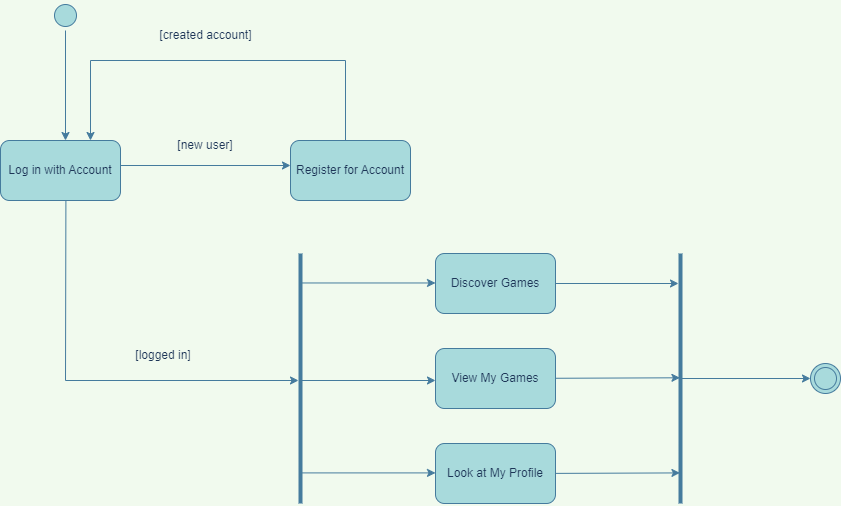

# Specification Phase Exercise

## Team members

- Jonason Wu (jw5911): [Github Profile](https://github.com/JonasonWu)
- Sagynbek Talgatuly (st4121): [Github Profile](https://github.com/sagynbek001)
- Victoria Zhang (rz1424): [Github Profile](https://github.com/Ruixi-Zhang)
- James Liu (sl8052): [Github Profile](https://github.com/liushuchen2025)

---

## Stakeholders

- We interviewed, _____,  a student majoring in game design. He spends a lot of time playing mobile games in his free time. 
- We asked him the following questions during the interview:
  - Where would you go to download mobile games?

  - Where do you get your game recommendations?

  - What is your opinion on the app store's game section. Do you find it useful? Why?

  - Do you want to know more about your game playing habit? 

  - If a game recommendation app can quickly redirect you to the game or the app store, would you find this functionality helpful?

- Based on his responses, we concluded the following problems and goals. 
  - 4 problems/frustrations

    - The current app store does not have a download history specifically for games. There is no place that shows and organizes the games that users download.
  
    - The game discovery section for the app store is not very useful. Popular games are occupying the discovery page. There is a lack of filters and categories. It is hard to find new games to play.
  
    - The games in the app store are not labeled well. It is hard to find similar games based on labels and categories.

    - It is hard to keep track of game playing habits and schedules. The only way is to go to the screen time section in settings, but the screen time section also contains the screen times of non-game-related apps.

  - 4 goals

    - The user would like a place that can collectively shows and manage all of the downloaded games and download history.
  
    - The user wants a personalized game discovery page that contain all kinds of games, allow sorting games by category, and support game filtering.
  
    - The user wants each game to contain clear labels (for example: action, card, simulation, etc.) and a description. It would be better if there is a comment section for each game.
  
    - The user wants a place that shows all of his game playing habits (information collected and visualized from screen time). It would be better if such information can be shown to his friend so that his friend can know his or her gaming habit better and schedule gaming times easier.

---

## Product Vision Statement

A personalized mobile game finder app that provides a play-stats dashboard and quick launch.

---

## User Requirements

### User Stories

1.  As a player, I want to sign up, so that I can start using the app.
2.  As a player, I want to search games, so that I can install games I want to play.
3.  As a player, I want to be able to delete games I don't like, so that I don't see them.
4.  As a player, I want to know how many hours I played, so that I don't play too much.
5.  As a player, I want to track my performance, so that I can feel a sense of accomplishment.
6.  As a player, I want to be able to play games offline, so I can play anytime and anywhere.
7.  As a player, I want to play games without ads, so that I do not get distracted.
8.  As a player, I want to have games categorized, so that I can find games easier.
9.  As a player, I want to see comments and ratings on games, so that I can choose the right games.
10. As a player, I want to share my playing habits with friends, so that we can play together.

---

## UML Activity Diagrams

1. User Story: As a player, I want to sign up, so that I can start using the app.

2. User Story: As a player, I want to search games, so that I can install games I want to play.

---

## Miscellaneous

* See this [google doc](https://docs.google.com/document/d/1uuLf8-Hde8k2mycQzfeQlwOh2JYok_Nh9vkbHjUwj-4/edit) for details on the Ideation stage and other optional user stories that would be nice to have for the mobile app.